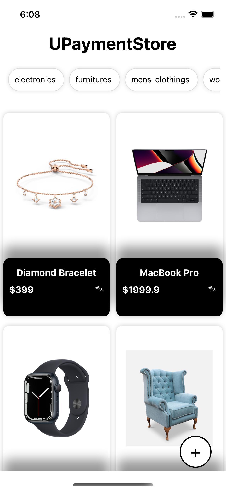
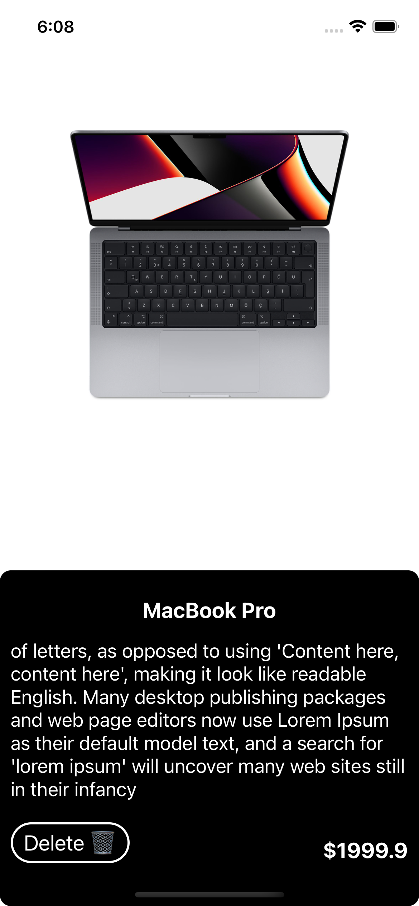
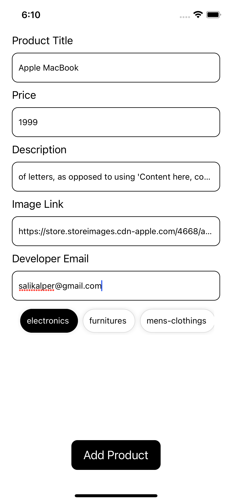
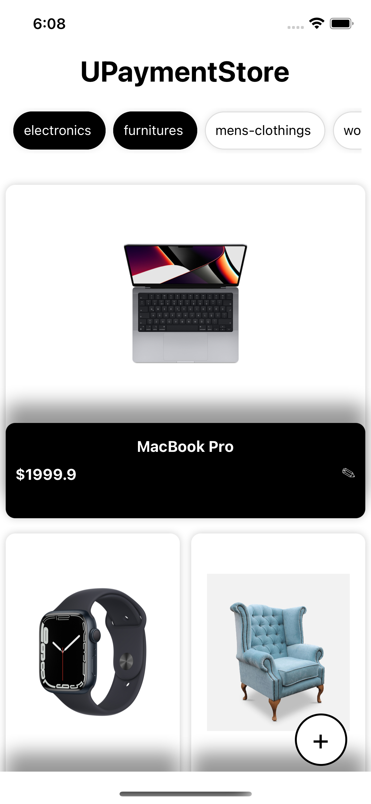
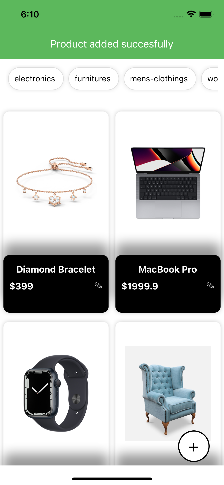

# UPayments_case_study

<div>





</div>

 

## Running Project

In this project, I created an App according to the case_study. This app get products data from api and then show them in screen as a list. Also you can filter that products from category buttons. When you click one product detail screen will open. You can see details of that product and also you can delete this product by clicking delete button on detail screen. When you click add button, the create screen will open. You can create new product from this screen. If you don't fill all parts you will see flash message.


After the project is downloaded, the project is opened with the 'Visual Studio Code' editor.

At the terminal;
```
yarn install 

```
```
cd ios && pod install && cd ..

```
The packages used in the project with the command line are created in the "node_modules" folder.
```
yarn ios or yarn android
```
command is run.
